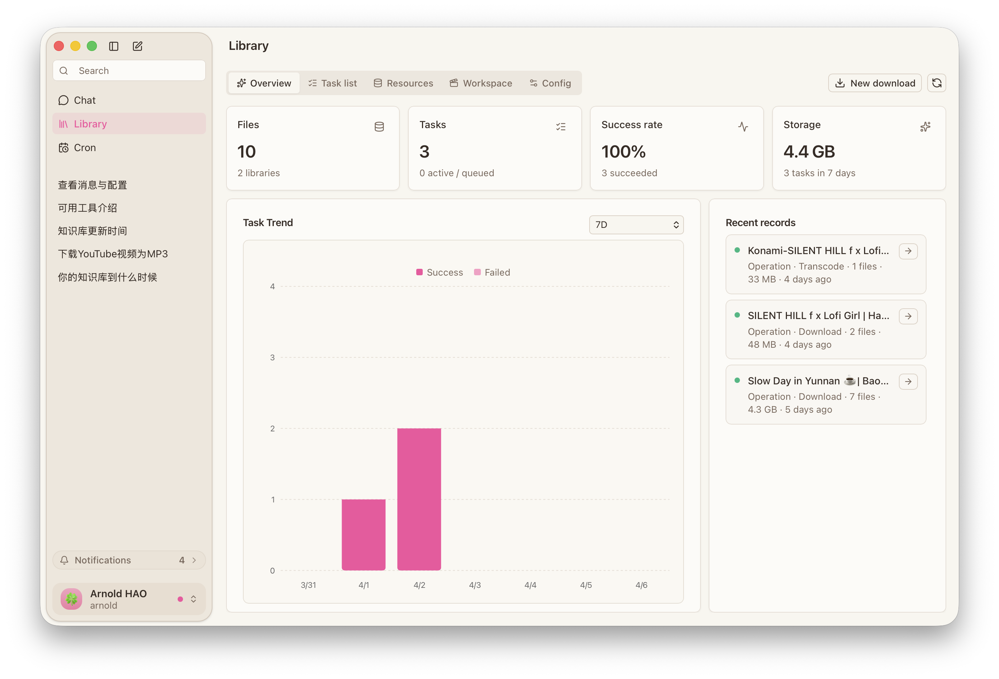

<h1 align="center">CanMe</h1>

  <strong>English</strong> |
  <a href="/README_zh.md"><strong>简体中文</strong></a>

  
  
  

  <strong>CanMe is a comprehensive multilingual video download manager with a fluid user experience and powerful content processing capabilities.</strong>

  <strong>Built on <a href="https://github.com/yt-dlp/yt-dlp">yt-dlp</a>, supporting multiple video platforms with real-time download progress and multilingual interface.</strong>

  

 

## ✨ Key Features

- 🎬 **Powerful Video Downloads** - Support for content from various video platforms
- 📝 **Subtitle Extraction** - Automatically download associated video subtitles
- 🔄 **Real-time Progress** - Intuitive display of download status and progress
- 🌐 **Multilingual Support** - Complete English and Chinese interfaces
- 💻 **Cross-platform Compatibility** - Support for Windows and macOS systems

## 🚀 Project Information

> This project aims to explore front-end and back-end development technologies by providing a complete solution for a real-world application scenario. As a personal learning project, the software may have some areas for improvement, your understanding is appreciated.

## 📋 Current Version

### ✅ Updates
- 🔄 Refactored download module using yt-dlp as the core download engine
- 🎨 New UI design based on Vue3 + TailwindCSS + DaisyUI
- 🧹 Optimized code structure and removed redundant features

### ⚠️ Requirements
- 🔧 **Dependencies**: `ffmpeg` needs to be installed separately
- 🌐 **Network**: Stable internet connection required for the first use to download essential `go-ytdlp` components

### ❗ Known Issues
- When downloading YouTube videos with subtitles simultaneously, the progress indicator may not update, but downloads will complete successfully
- The current version does not support pausing downloads, this feature will be added in upcoming versions

## 🔮 Future Plans

### Short-term Goals
- ⛓️ **Download Pipeline**
  - 🤖 Support for AI API integration
  - 🔄 AI-based subtitle translation
  - 📺 Subtitle embedding functionality

### Long-term Goals
- 🧠 **AI Enhanced Features**
  - 💬 Intelligent conversation assistant
  - 📝 Language learning tools (e.g., IELTS essay review)
  - 📊 Content analysis and recommendations

© 2025 <a href="https://github.com/arnoldhao">Arnold Hao</a>. All rights reserved.
