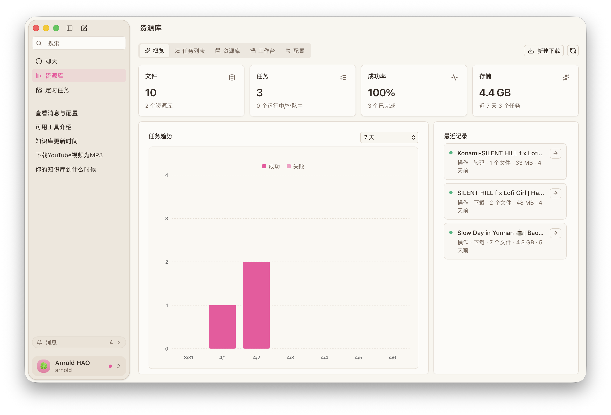

  
  <h1>追创作 / Dream Creator</h1>
  
一款面向创作者的人工智能桌面助手

  

    <strong>简体中文</strong> ·
    <a href="./README_en.md">English</a>
  

  

    
    
    
    
  

## 项目简介

追创作是一款同时支持 macOS 与 Windows 的跨平台桌面应用，面向创作者提供视频下载、字幕翻译、转码处理与 AI 助手能力。
> 当前项目基于 Wails 3。由于 Wails 3 仍处于 Alpha 阶段，后续版本可能出现破坏性变更。
>
> 当前版本仍在持续优化中，部分对话与工具调用会产生较高词元消耗，建议优先使用成本较低的模型进行日常试用。

## 界面预览

## 适用场景

- 素材收集：用于下载、整理和转码创作所需的视频素材。
- 字幕处理：用于字幕校对、翻译与导出，适配不同发布流程。
- 资料获取：通过 AI 对话结合内置工具与技能，辅助完成创作前的检索、整理与参考。

## 核心能力

- `聊天与助手`：支持多会话管理，并可按任务配置不同 Assistant，明确区分不同工作目标与上下文。
- `素材库`：统一管理下载内容、导入资源、任务历史与处理结果，减少素材分散和状态失真。
- `任务处理`：围绕素材执行转码、字幕导入、字幕翻译等后续动作，并保留过程记录。
- `定时任务`：按计划触发提醒、检查或助手运行，为可重复流程提供稳定入口。
- `模型与服务商配置`：支持接入不同 Provider，为不同任务选择合适的模型与调用方式。
- `连接与接入`：为浏览器站点、Webhook、频道等接入能力提供统一入口，便于纳入既有流程。
- `外部工具管理`：集中管理 `yt-dlp`、`FFmpeg`、`bun`、`playwright` 等依赖的安装、检查与更新。

## 如何使用

### 一、下载安装

1. **下载对应安装包**：点击以下直链即可下载最新版本；如需查看历史版本，可前往 [GitHub Releases](https://github.com/arnoldhao/dreamcreator/releases)：
   - macOS Apple Silicon：[点击下载](https://updates.dreamapp.cc/dreamcreator/downloads/dreamcreator-macos-arm64-latest.zip)
   - macOS Intel：[点击下载](https://updates.dreamapp.cc/dreamcreator/downloads/dreamcreator-macos-x64-latest.zip)
   - Windows 安装版：[点击下载](https://updates.dreamapp.cc/dreamcreator/downloads/dreamcreator-windows-x64-latest-installer.exe)
   - Windows 便携版：[点击下载](https://updates.dreamapp.cc/dreamcreator/downloads/dreamcreator-windows-x64-latest.zip)
2. **首次运行 macOS**：解压 `.zip` 后，将 `DreamCreator.app` 移动到“应用程序”目录。若系统提示“无法打开”或“已损坏”，请在终端执行：

   `sudo xattr -rd com.apple.quarantine /Applications/DreamCreator.app`
3. **首次运行 Windows**：安装版双击 `.exe` 按提示安装；便携版解压 `.zip` 后直接运行。若首次启动出现 SmartScreen 提示，点击“更多信息 → 仍要运行”。

### 二、供应商 / Provider

- 项目运行在本地，需由用户自行配置 Provider API Key。应用内置若干常见 Provider，也支持自定义添加。

### 三、依赖外部工具

- 首次启动后，应用会引导安装所需的外部工具。相关依赖未随安装包内置，以便控制安装包体积并简化后续更新。

## 项目状态

- 这是一个`个人学习项目`，`暂不接受 Pull Request`
- 如果你只是想反馈问题或交流想法，可以提 Issue 或直接发邮件。
- 当前仓库使用 `Apache-2.0` 许可证，具体见根目录 [LICENSE](./LICENSE)。

## 联系方式

- 官网：<https://dreamcreator.dreamapp.cc>
- 邮箱：<xunruhao@gmail.com>
