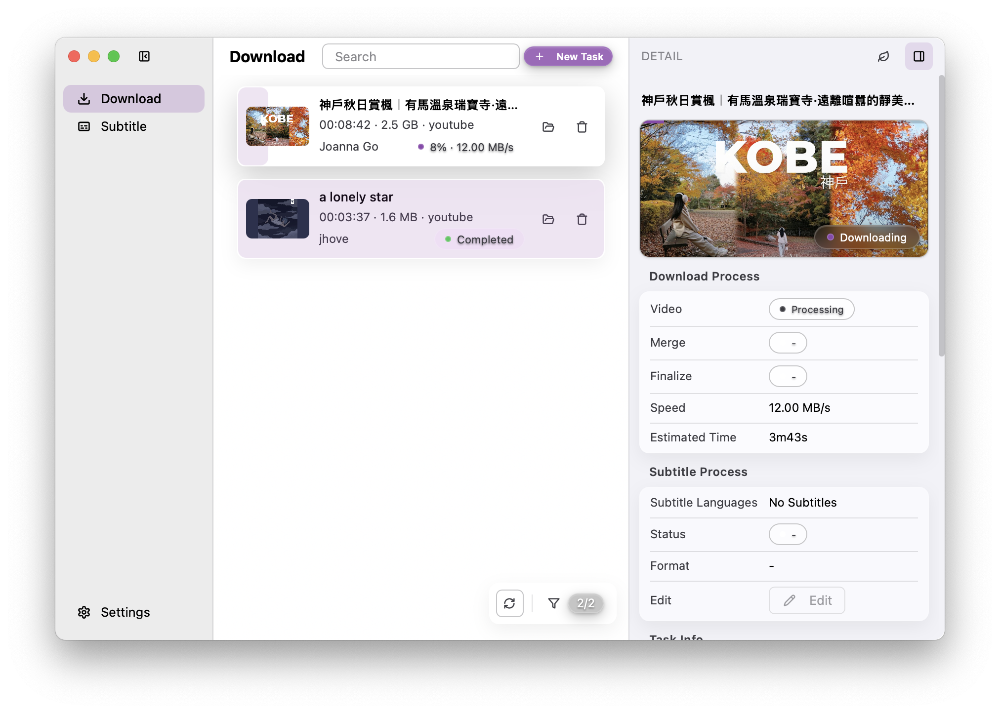

<h1 align="center">CanMe</h1>

  <strong>English</strong> |
  <a href="/README_zh.md"><strong>简体中文</strong></a>

  
  
  
  

  <strong>CanMe is a comprehensive multilingual video download manager with advanced subtitle processing capabilities and a fluid user experience.</strong>

  <strong>Built on <a href="https://github.com/yt-dlp/yt-dlp">yt-dlp</a>, supporting multiple video platforms with real-time download progress, multilingual interface, and professional subtitle workflow.</strong>

  

 

## ✨ Core Features

### 🎬 Video Download Engine
- **Multi-platform Support** - Download from various video platforms with yt-dlp integration
- **Real-time Progress** - Live download status with detailed progress indicators
- **Format Selection** - Choose from available video/audio quality options
- **Batch Processing** - Queue multiple downloads with smart management

### 📝 Advanced Subtitle System
- **📥 Import Support** - ITT and SRT subtitle format import
- **📤 Export Formats** - Export to SRT and FCPXML for professional editing
- **🔄 Auto-extraction** - Automatically download video subtitles when available
- **🎯 Precision Timing** - Maintain accurate subtitle synchronization

### 🌐 User Experience
- **Multilingual Interface** - Complete English and Chinese language support
- **Cross-platform** - Native support for Windows and macOS
- **Modern UI** - Clean design built with Vue3 + TailwindCSS + DaisyUI
- **MCP Integration** - Model Context Protocol support for LLM workflows

### 🔧 Technical Capabilities
- **Video Recoding** - Convert between different video/audio formats
- **Proxy Support** - Network proxy configuration for global access
- **Local Storage** - Efficient local data management with BBolt
- **WebSocket Communication** - Real-time updates and notifications

## 🚀 Getting Started

### Prerequisites
- **FFmpeg** - Required for video processing and format conversion
- **Stable Internet** - Initial setup downloads essential yt-dlp components
- **System Requirements** - Windows 10+ or macOS 10.15+

### Installation
1. Download the latest release for your platform
2. Install FFmpeg on your system
3. Launch CanMe and follow the setup wizard

## 📋 Version Information

### 🆕 Latest Updates
- ✨ **New Subtitle Export System** - Professional ITT/SRT import and SRT/FCPXML export
- 🔄 Enhanced download engine with yt-dlp core integration
- 🎨 Redesigned UI with improved user experience
- 🧹 Streamlined codebase with optimized performance
- 🔧 Advanced video recoding capabilities

### ⚠️ System Requirements
- 🔧 **Dependencies**: FFmpeg installation required
- 🌐 **Network**: Internet connection needed for initial component download
- 💾 **Storage**: Adequate disk space for downloads and processing

### 📌 Known Limitations
- YouTube subtitle downloads may not show progress updates (downloads complete successfully)
- Download pause/resume functionality planned for future releases
- Some platforms may require additional authentication

## 🔮 Development Roadmap

### 🎯 Short-term Goals
- **Enhanced Subtitle Pipeline**
  - 🤖 AI-powered subtitle translation
  - 📺 Direct subtitle embedding in videos
  - 🔄 Batch subtitle processing
  - 🎨 Subtitle styling and formatting options

### 🚀 Long-term Vision
- **AI-Enhanced Workflow**
  - 💬 Intelligent content assistant
  - 📝 Educational tools (language learning, essay review)
  - 📊 Content analysis and recommendations
  - 🧠 Smart content categorization

## 🛠️ Technical Stack

- **Backend**: Go with Wails framework
- **Frontend**: Vue3 + TailwindCSS + DaisyUI
- **Video Processing**: yt-dlp + FFmpeg
- **Storage**: BBolt embedded database
- **Communication**: WebSocket for real-time updates

## 📖 Project Philosophy

> CanMe represents a journey in modern application development, combining robust backend engineering with elegant frontend design. This project serves as both a practical tool and a learning platform, exploring the intersection of video processing, user experience design, and cross-platform development.

## 🤝 Contributing

As a personal learning project, CanMe welcomes feedback and suggestions. While the codebase continues to evolve, your understanding and patience with ongoing improvements are appreciated.

---

© 2025 <a href="https://github.com/arnoldhao">Arnold Hao</a>. All rights reserved.
