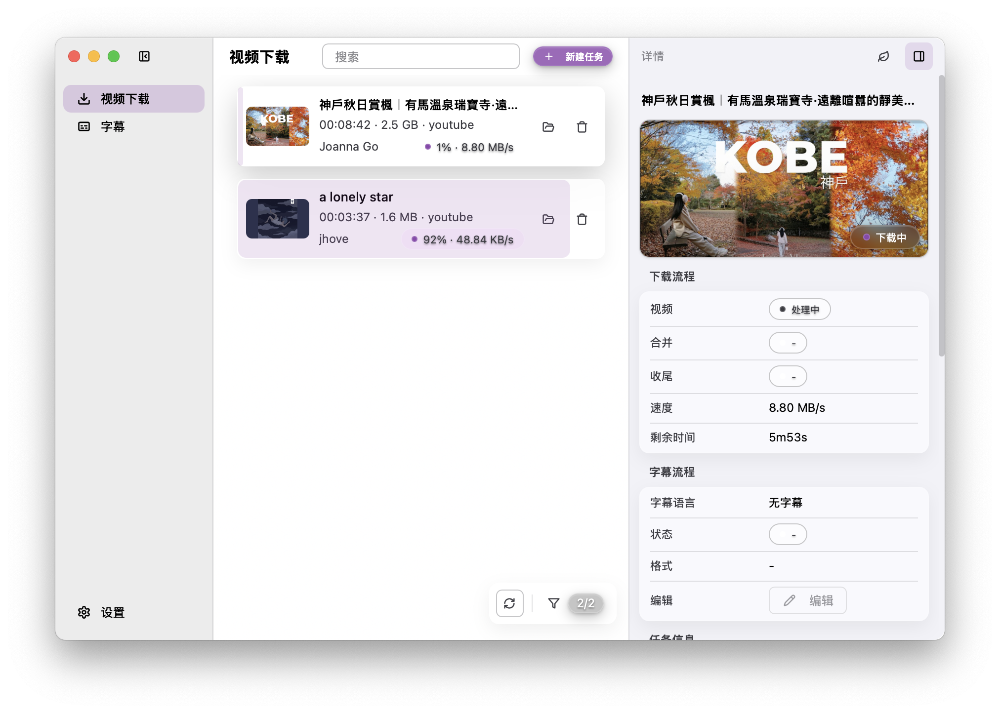

<div align="center">
  <a href="https://github.com/arnoldhao/dreamcreator/"></a>
</div>

<h1 align="center">追创作（DreamCreator）</h1>

<p align="center">
  <strong>简体中文</strong> |
  <a href="./README_en.md"><strong>English</strong></a>
</p>

<div align="center">
  
  
  
  
</div>

> 追创作是一款面向视频创作者的开源桌面工作站，聚焦「素材获取 → 字幕编辑 → 全球发行」的完整创作链路。

---

## 目录
- [项目简介](#项目简介)
- [核心能力](#核心能力)
- [首次使用指南](#首次使用指南)
- [从源码构建](#从源码构建)
- [文档与支持](#文档与支持)
- [贡献指南](#贡献指南)
- [致谢](#致谢)
- [许可证](#许可证)

## 项目简介
追创作（DreamCreator）依托 Go + Wails 后端与 Vue 3 前端，为创作者提供材料采集、字幕润色与跨语言交付的一站式体验。我们坚持界面极简、稳定可依赖，并在代理、Cookies 管理、依赖校验等基础能力上做了大量增强，力求成为视频创作者的趁手工具。

## 界面预览


## 核心能力
- **素材获取 Download**：集成 yt-dlp，在千余个[视频网站](https://github.com/yt-dlp/yt-dlp/blob/master/supportedsites.md)上进行分轨下载，支持浏览器同步与自定义集合的 Cookies 管理、HTTP/SOCKS/PAC 代理，以及可视化的任务进度。详细指南请查看[《素材获取》](https://dreamapp.cc/zh-CN/docs/dreamcreator/download)。
- **字幕编辑 Subtitle**：支持 SRT、VTT、ASS/SSA、ITT、FCPXML 等格式，内置 Netflix/BBC/ADE 指导标准与交通灯反馈，结合繁化姬提供多地区中文转换。使用说明见[《字幕编辑》](https://dreamapp.cc/zh-CN/docs/dreamcreator/subtitles)。
- **全球发行 Transcode（开发中）**：当前通过 yt-dlp 调用 FFmpeg 实现基础转码，未来将扩展 GPU 转码与多套发行预设。规划详情可在[《全球发行》](https://dreamapp.cc/zh-CN/docs/dreamcreator/transcode)了解。

## 首次使用指南
1. **下载发行版**：前往 [GitHub Releases](https://github.com/arnoldhao/dreamcreator/releases) 选择对应的安装包。macOS 用户使用 `.dmg`（Apple silicon 请选择 `arm64` 版本，Intel 请选择 `intel` 版本），Windows 用户根据需求选择 `.exe` 安装包或 `.zip` 便携版。
2. **通过系统安全提示**：
   - macOS：右键应用选择“打开”，或执行 `sudo xattr -rd com.apple.quarantine /Applications/DreamCreator.app` 移除隔离。
   - Windows：首次运行若出现 SmartScreen 提示，点击“更多信息 → 仍要运行”。
3. **首次启动**：应用会自动释放 yt-dlp 与 FFmpeg 并完成健康检查。如需代理，请在启动后立刻前往 **设置 → 通用设置 → 网络** 进行配置。
4. **检查全局设置**：在 **设置 → 通用设置** 指定下载目录、数据目录与日志策略，确认是否启用自动更新。更多配置说明见[《软件配置》](https://dreamapp.cc/zh-CN/docs/dreamcreator/settings)。
5. **准备 Cookies**：在 **下载 → 浏览器 Cookies** 中，同步 Chrome/Edge/Firefox/Brave/Vivaldi 等浏览器的 Cookies，或在“自定义集合”导入 Netscape/JSON/Header 数据。Safari 与部分 Windows 浏览器受系统限制暂不支持自动同步。
6. **创建首个下载任务**：点击“新建任务”解析视频链接，先确认已选 Cookies，再在自定义或快速模式中选择需要的音视频轨与字幕。下载过程会分阶段展示“探测 → 获取 → 合并 → 收尾”。
7. **润色字幕**：若在下载时选择了字幕，可在任务详情中点击“编辑”进入字幕工作台，按需选择 Netflix/BBC/ADE 指导标准，或通过“添加语言”调用繁化姬完成地区化转换。操作细节请参阅[《字幕编辑》](https://dreamapp.cc/zh-CN/docs/dreamcreator/subtitles)。
8. **维护依赖**：在 **设置 → 依赖** 中执行“快速校验/验证/检查更新”，必要时使用“修复”或“更新”按钮保持 yt-dlp 与 FFmpeg 的最新状态。后台会自动校验 SHA，更新完成后替换旧版本。

## 从源码构建
运行环境：Go 1.24+、Node.js 18+、Wails CLI。

```bash
# 安装后端依赖
go mod tidy

# 安装前端依赖
cd frontend
npm install

# 回到项目根目录构建桌面应用
wails build
```
开发过程中可执行 `wails dev` 获得热更新体验。

## 文档与支持
- 产品概览：https://dreamapp.cc/zh-CN/products/dreamcreator
- 中文文档导航：https://dreamapp.cc/zh-CN/docs/dreamcreator
- 英文文档导航：https://dreamapp.cc/docs/dreamcreator
- 反馈与支持：xunruhao@gmail.com

## 贡献指南
欢迎通过 Issue 报告问题或提交改进建议。修复与新特性请先在 Issue 中沟通，再提交 Pull Request，以便团队评估需求、保持迭代节奏。如需参与路线图讨论，可关注 GitHub Projects 与 Issues。

## 致谢
追创作的发展离不开以下优秀开源项目与服务：
- [Go](https://go.dev/) 与 [Wails](https://wails.io/) 提供跨平台桌面应用基础设施
- [Vue 3](https://vuejs.org/) 与相关生态构建现代化前端界面
- [yt-dlp](https://github.com/yt-dlp/yt-dlp) 提供强大的在线视频解析与下载能力
- [FFmpeg](https://ffmpeg.org/) 支撑音视频转码处理
- [繁化姬](https://zhconvert.org/) 提供专业的中文地区化转换
- 社区贡献者与使用者提出的宝贵反馈

## 许可证
本项目基于 [Apache License 2.0](LICENSE) 开源。
