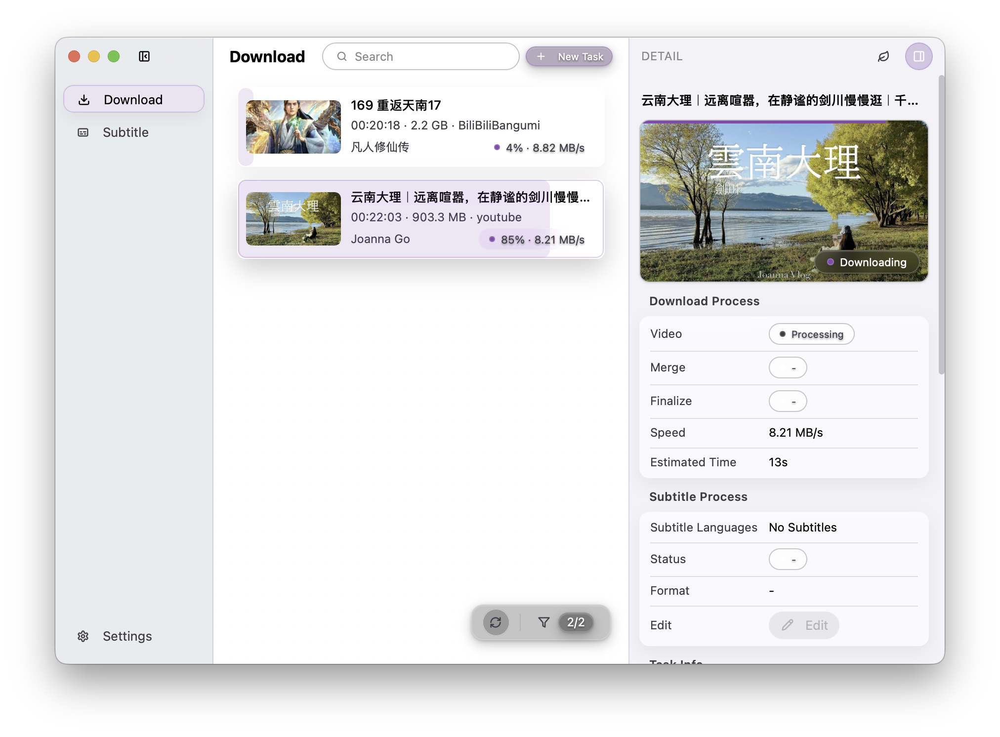

<div align="center">
  <a href="https://github.com/arnoldhao/dreamcreator/"></a>
</div>

<h1 align="center">DreamCreator</h1>

<p align="center">
  <a href="./README.md"><strong>简体中文</strong></a> |
  <strong>English</strong>
</p>

<div align="center">
  
  
  
  
</div>

> DreamCreator is an open-source desktop workstation for video creators, covering the full journey from **capturing source material** to **subtitle polish & AI translation** and **global delivery prep**.

---

## Table of Contents
- [Project Overview](#project-overview)
- [Core Capabilities](#core-capabilities)
- [First-Time Setup](#first-time-setup)
- [Build from Source](#build-from-source)
- [Docs & Support](#docs--support)
- [Contributing](#contributing)
- [Acknowledgements](#acknowledgements)
- [License](#license)

## Project Overview
DreamCreator combines a Go + Wails backend with a Vue 3 frontend to offer creators an integrated experience for gathering footage, refining subtitles, and preparing multilingual releases. The interface stays minimal while we invest heavily in proxy routing, cookie management, dependency checks, and other reliability features that matter in real production workflows.

## UI Preview


## Core Capabilities
- **Download**: Built on yt-dlp to access thousands of [video sites](https://github.com/yt-dlp/yt-dlp/blob/master/supportedsites.md), with browser cookie sync, custom collections, HTTP/SOCKS/PAC proxy support, and clear task visualisation. Explore details in the [Download guide](https://dreamapp.cc/docs/dreamcreator/download).
- **Subtitles**: Import SRT, VTT, ASS/SSA, ITT, FCPXML and more. Netflix / BBC / ADE presets surface duration, CPS, WPM, and CPL via traffic-light indicators, while Fanhuaji enables accurate Mainland/Hong Kong/Taiwan conversions. See the [Subtitle guide](https://dreamapp.cc/docs/dreamcreator/subtitles).
- **AI Translation**: LLM-powered subtitle translation with OpenAI/Anthropic-compatible or remote providers, global style profiles, glossary with strict mode, saved translation conversations, and one-click retries for failed segments.
- **Transcode (in development)**: Currently leverages yt-dlp’s FFmpeg integration for baseline mux/remux. Planned upgrades include GPU acceleration and publishing presets—follow along in the [Transcode overview](https://dreamapp.cc/docs/dreamcreator/transcode).

## First-Time Setup

### Install and Launch
1. **Download a release** from [GitHub Releases](https://github.com/arnoldhao/dreamcreator/releases). macOS users should pick the `.dmg` for their architecture (Apple silicon `arm64`, Intel `intel`); Windows users can choose the `.exe` installer or `.zip` portable build.
2. **Clear trust prompts**:
   - macOS: Control-click the app and choose “Open”, or run `sudo xattr -rd com.apple.quarantine /Applications/DreamCreator.app` to remove quarantine.
   - Windows: If SmartScreen warns you, click “More info → Run anyway”.

### Quick tour
1. **Create your first download task**: Click “New Task”, paste a URL, confirm the right cookies, then pick tracks and subtitles via Custom or Quick mode. Progress is tracked across probe → fetch → merge → finalize.
2. **Polish subtitles**: When subtitles are available, open the task, hit “Edit”, and use Netflix/BBC/ADE presets or “Add Language” for Fanhuaji conversions. See the [Subtitle guide](https://dreamapp.cc/docs/dreamcreator/subtitles) for every option.
3. **AI-translate subtitles**: In the subtitle workspace, click Add Language → AI Translation, pick source/target plus provider/model, optionally apply a global profile, glossary, and strict mode; retry failed segments from the same panel.

### Advanced capabilities
1. **Proxy-ready first launch**: The initial run unpacks yt-dlp and FFmpeg and performs a health check; configure HTTP/SOCKS/PAC proxies in **Settings → General → Network** if needed.
2. **Browser cookie integration**: Visit **Downloads → Browser Cookies** to sync Chrome/Edge/Firefox/Brave/Vivaldi or paste Netscape/JSON/header strings into a custom collection for members-only content.
3. **Tailored global settings**: Under **Settings → General**, adjust download/data directories, logging, language, theme, and auto-updates for a workflow-aligned experience. More details live in the [Settings guide](https://dreamapp.cc/docs/dreamcreator/settings).
4. **LLM providers & profiles**: Use the Providers page to add OpenAI/Anthropic-compatible or remote endpoints, set API base URL and keys, refresh model lists, and reset presets/cache when needed to keep AI translation running smoothly.

### Dependency health
1. **Keep yt-dlp & FFmpeg fresh**: Navigate to **Settings → Dependencies** to run Quick Check / Verify / Check Updates, and use Repair or Update to stay current; SHA verification ensures safe swaps.

## Build from Source
Prerequisites: Go 1.25.4, Node.js 24.11.0, Wails CLI.

```bash
# Install backend dependencies
go mod tidy

# Install frontend dependencies
cd frontend
npm install

# Build the desktop app from the project root
wails build
```
Use `wails dev` during development for hot reload.

## Docs & Support
- Product overview: https://dreamapp.cc/products/dreamcreator
- Chinese docs hub: https://dreamapp.cc/zh-CN/docs/dreamcreator
- English docs hub: https://dreamapp.cc/docs/dreamcreator
- Email: xunruhao@gmail.com

## Contributing
Issues, bug fixes, and feature ideas are all welcome. Please open an Issue to discuss major changes before submitting a Pull Request so we can align on scope and review bandwidth. Roadmap items and community discussions live on GitHub Projects and Issues.

## Acknowledgements
DreamCreator would not exist without these outstanding projects and services:
- [Go](https://go.dev/) & [Wails](https://wails.io/) for cross-platform desktop infrastructure
- [Vue 3](https://vuejs.org/) and its ecosystem for a modern frontend
- [yt-dlp](https://github.com/yt-dlp/yt-dlp) for robust online video extraction
- [FFmpeg](https://ffmpeg.org/) powering audio/video processing
- [Fanhuaji](https://zhconvert.org/) for region-aware Chinese conversion
- Community contributors and early adopters for priceless feedback

## License
Distributed under the [Apache License 2.0](LICENSE).
