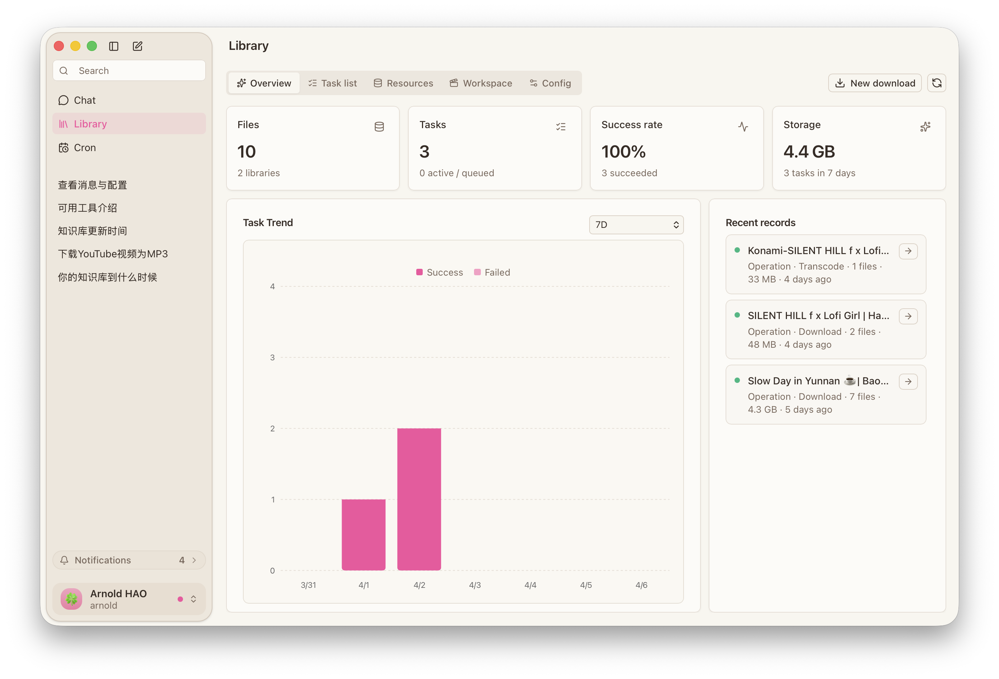

  
  <h1>Dream Creator</h1>
  
An AI desktop assistant built for creators.

  

    <a href="./README.md">简体中文</a> ·
    <strong>English</strong>
  

  

    
    
    
    
  

## Overview

Dream Creator is a cross-platform desktop application for macOS and Windows. It is built for creators who need video download, subtitle translation, transcoding, and AI assistant capabilities in the same workspace.

> The current project is based on Wails 3. Since Wails 3 is still in Alpha, future versions may introduce breaking changes.
>
> The current build is still under active optimization. Some conversations and tool calls can consume a large number of tokens, so lower-cost models are recommended for day-to-day use.

## Screenshot

## Use Cases

- Media collection: download, organize, and transcode video assets needed for creative work.
- Subtitle handling: review, translate, and export subtitles for different publishing workflows.
- Research support: use AI conversations together with built-in tools and skills to assist with search, organization, and reference gathering before production.

## Core Capabilities

- `Chat and assistants`: manage multiple conversations and configure different assistants for different goals and contexts.
- `Library`: keep downloads, imported assets, task history, and outputs in one place to reduce fragmentation.
- `Task processing`: continue from media assets into transcode, subtitle import, subtitle translation, and related follow-up actions with recorded history.
- `Cron jobs`: trigger reminders, checks, or assistant runs on a schedule and provide a stable entry point for repeatable workflows.
- `Provider configuration`: connect different providers and choose models that fit different tasks.
- `Connections and integrations`: provide a unified entry point for browser sites, webhooks, channels, and related integrations.
- `External tool management`: centrally manage installation, verification, and updates for dependencies such as `yt-dlp`, `FFmpeg`, `bun`, and `playwright`.

## How to Use

### 1. Download and install

1. **Download the right package**: use the direct links below to download the latest build. If you need older releases, see [GitHub Releases](https://github.com/arnoldhao/dreamcreator/releases):
   - macOS Apple Silicon: [Download](https://updates.dreamapp.cc/dreamcreator/downloads/dreamcreator-macos-arm64-latest.zip)
   - macOS Intel: [Download](https://updates.dreamapp.cc/dreamcreator/downloads/dreamcreator-macos-x64-latest.zip)
   - Windows Installer: [Download](https://updates.dreamapp.cc/dreamcreator/downloads/dreamcreator-windows-x64-latest-installer.exe)
   - Windows Portable: [Download](https://updates.dreamapp.cc/dreamcreator/downloads/dreamcreator-windows-x64-latest.zip)
2. **First launch on macOS**: unzip the package, move `DreamCreator.app` to the Applications folder, and if macOS says the app can't be opened or is damaged, run:

   `sudo xattr -rd com.apple.quarantine /Applications/DreamCreator.app`
3. **First launch on Windows**: double-click the `.exe` installer or unzip the portable `.zip` package and run it. If SmartScreen appears on first launch, choose `More info` and then `Run anyway`.

### 2. Providers

- The application runs locally, so users need to configure their own Provider API keys. Several common providers are built in, and custom providers can also be added.

### 3. External tools

- On first launch, the app guides users through installing the required external tools. These dependencies are not bundled into the installation package in order to keep package size under control and simplify future updates.

## Project Status

- This is a `personal learning project`, and `pull requests are not being accepted`.
- If you want to share ideas or report issues, use GitHub Issues or email.
- This repository is licensed under `Apache-2.0`. See [LICENSE](./LICENSE).

## Contact

- Website: <https://dreamcreator.dreamapp.cc>
- Email: <xunruhao@gmail.com>
