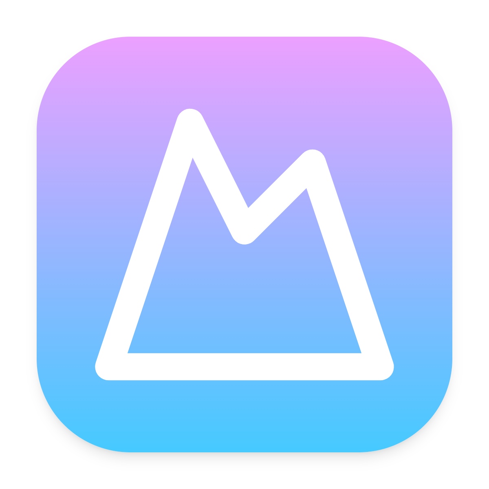
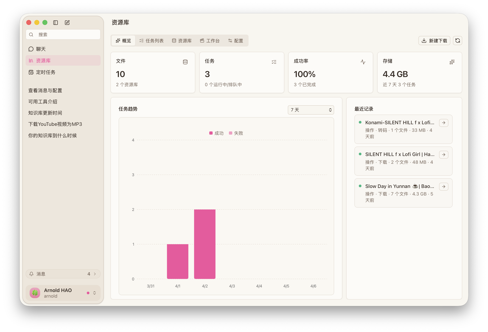

<h1 align="center">CanMe</h1>

  <a href="/"><strong>English</strong></a> |
  <strong>简体中文</strong>

  
  
  

  <strong>CanMe 是一个功能完善的多语言视频下载管理工具，提供流畅的用户体验与强大的内容处理能力。</strong>

  <strong>基于 <a href="https://github.com/yt-dlp/yt-dlp">yt-dlp</a> 构建，支持多种视频平台，实时展示下载进度，中英文界面自由切换。</strong>

  

 

## ✨ 特色功能

- 🎬 **强大的视频下载** - 支持多种视频平台内容获取
- 📝 **字幕获取** - 自动下载视频关联字幕
- 🔄 **实时进度** - 直观展示下载状态与进度
- 🌐 **多语言支持** - 完整的中英文界面
- 💻 **跨平台兼容** - 支持 Windows 与 macOS 系统

## 🚀 项目说明

> 本项目旨在学习前后端开发技术，提供一个实际应用场景的完整解决方案。作为个人学习成果，软件可能存在一些待优化的细节，敬请理解。

## 📋 当前版本: 

### ✅ 更新内容
- 🔄 重构下载模块，采用 yt-dlp 作为核心下载引擎
- 🎨 全新界面设计，基于 Vue3 + TailwindCSS + DaisyUI
- 🧹 优化代码结构，移除冗余功能

### ⚠️ 使用须知
- 🔧 **环境依赖**: 需要自行安装 `ffmpeg`
- 🌐 **网络要求**: 首次使用时需保持网络通畅，以下载必要的 `go-ytdlp` 组件

### ❗ 已知问题
- 同时下载 YouTube 视频和字幕时，进度指示器可能不会更新，但下载过程仍能正常完成
- 当前版本暂不支持下载暂停功能，计划在后续版本中添加

## 🔮 未来规划

### 近期计划
- ⛓️ **下载流水线**
  - 🤖 支持接入 AI API
  - 🔄 基于 AI 的字幕翻译功能
  - 📺 字幕嵌入视频功能

### 远期目标
- 🧠 **AI 增强功能**
  - 💬 智能对话助手
  - 📝 语言学习辅助工具（如雅思作文批改）
  - 📊 内容分析与推荐

© 2025 <a href="https://github.com/arnoldhao">Arnold Hao</a>. 保留所有权利。
